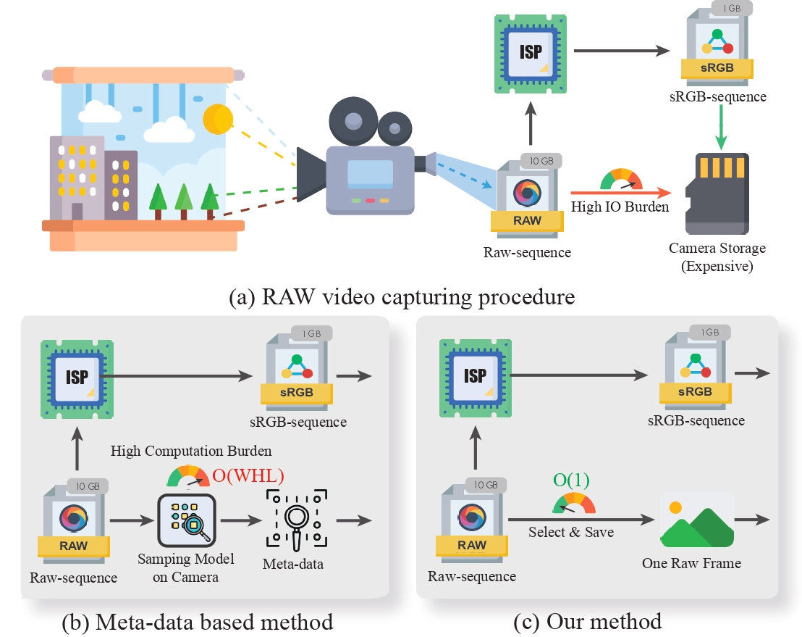
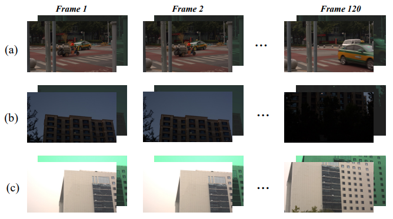
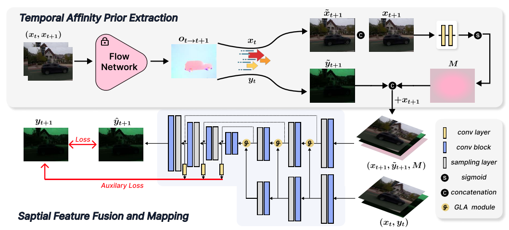

<div style="text-align: center;">
  <h1>Leveraging Frame Affinity for sRGB-to-RAW Video De-rendering(CVPR 2024)</h1>
</div>

[Chen Zhang](https://scholar.google.com/citations?user=qRcKyw0AAAAJ&hl=zh-CN)<sup>1,\*</sup>
| [Wencheng Han](https://scholar.google.com/citations?user=hGZueIUAAAAJ&hl=zh-CN&oi=ao)<sup>2,\*</sup>
| Yang Zhou<sup>1</sup>
| [Jianbing Shen](https://scholar.google.com/citations?user=_Q3NTToAAAAJ&hl=zh-CN&oi=ao)<sup>2,†</sup>
| [Cheng-zhong Xu](https://scholar.google.com/citations?user=XsBBTUgAAAAJ&hl=zh-CN&oi=ao)<sup>2</sup>
| [Wentao Liu](https://scholar.google.com/citations?user=KZn9NWEAAAAJ&hl=zh-CN&oi=ao)<sup>1,†</sup>

<sup>1</sup> *SenseTime Research and Tetras.AI*, 
<sup>2</sup> *SKL-IOTSC, CIS, University of Macau*

<sup>*</sup> Equal Contribution. <sup>†</sup> Corresponding Authors.

# 🔔 Overview
### Hightlights
- We propose a new architecture for **RAW video derendering**. This architecture can efficiently de-render
RAW video sequences using **only one RAW frame** and
sRGB videos as input. By adopting this method, both
storage and computation efficiency for RAW video capturing can be significantly improved.

<p align="center">

</p>

- We propose **a new benchmark** for RAW video derendering to comprehensively evaluate the methods for
this task. To our knowledge, this is the **first benchmark**
specifically designed for the RAW video de-rendering
task.
<p align="center">

</p>

### Framework
Overview of the Proposed Frame Affinity Guided De-rendering Network.
The framework consists of two main stages:
1. **Temporal Affinity Prior Extraction:**
This stage generates a reference RAW image by leveraging motion information between adjacent frames.
2. **Spatial Feature Fusion and Mapping:**
Using the reference RAW as the initial state, a pixel-level mapping function is learned to refine inaccurately predicted pixels from the first stage. This process incorporates guidance from the sRGB image and preceding frames.

<p align="center">

</p>

# ⏰ TODO List

- [ ] Dataset Release
- [ ] Model Release
- [x] Code Release


# 🔧 Installation
Our model does not use any hard-to-configure packages. You only need to install torch and some simple dependencies (such as numpy, cv2). By the way, we use pytorch 1.3 to implement the proposed method.

# 📁 Dataset


# 🔥Training
You can amend the startup script in 'scripts' folder to run our method. 

```
sh scripts/RVD_Part1.sh
sh scripts/RVD_Part2.sh
```

# ⚡ Checkpoints and Inference


# 🥰 Acknowledgements
Our dataset contains part of the data from Real-RawVSR Dataset(https://github.com/zmzhang1998/Real-RawVSR), thanks to the excellent work of Yue et al.

# 🎓 Citation
```
@inproceedings{zhang2024leveraging,
  title={Leveraging Frame Affinity for sRGB-to-RAW Video De-rendering},
  author={Zhang, Chen and Han, Wencheng and Zhou, Yang and Shen, Jianbing and Xu, Cheng-zhong and Liu, Wentao},
  booktitle={Proceedings of the IEEE/CVF Conference on Computer Vision and Pattern Recognition},
  pages={25659--25668},
  year={2024}
}